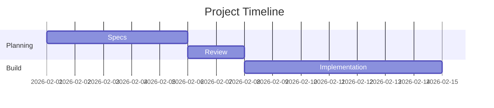

# Number
## Arithmetic
> ### Addition
```vba
Function Addition(A As Integer, B As Integer) As Integer
    Addition = A + B
End Function
```
> ### Subtraction
```vba
Function Subtraction(A As Integer, B As Integer) As Integer
    Subtraction = A - B
End Function
```
> ### Multiplication
```vba
Function Multiplication(A As Integer, B As Integer) As Integer
    Multiplication = A * B
End Function
```
> ### Division
```vba
Function Division(A As Integer, B As Integer) As Double
    If B = 0 Then
        Division = 0
    Else
        Division = A / B
    End If
End Function
```

<details>
<summary>Collapsible Section</summary>

Test 1 2 3

> ### Division
```vba
Function Division(A As Integer, B As Integer) As Double
    If B = 0 Then
        Division = 0
    Else
        Division = A / B
    End If
End Function
```

</details>

Press <kbd>CTRL</kbd> + <kbd>C</kbd>



