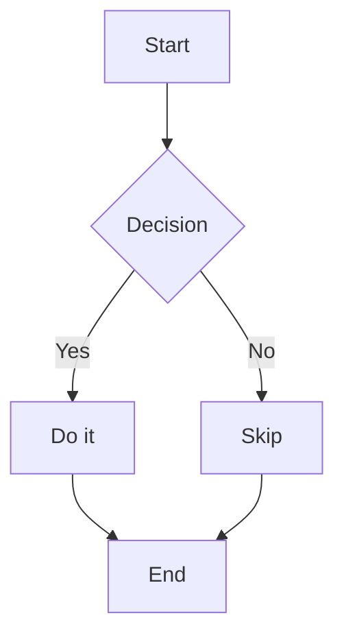
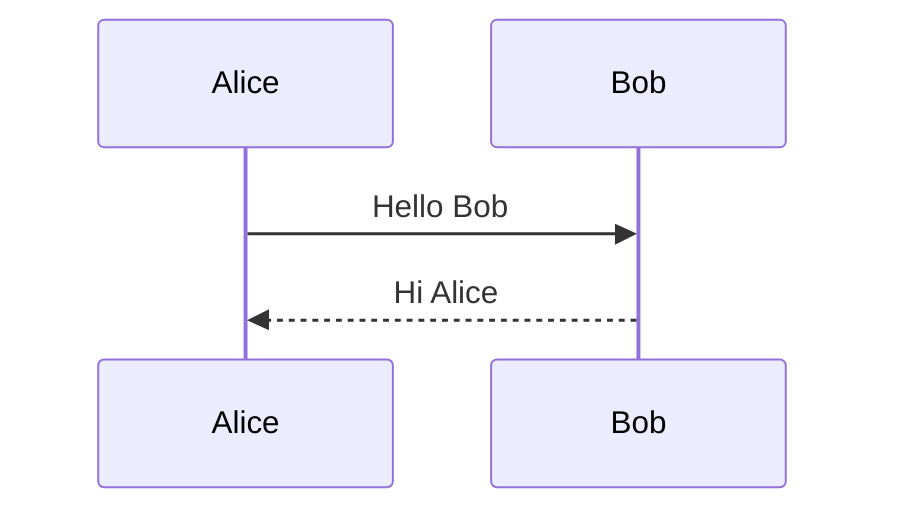
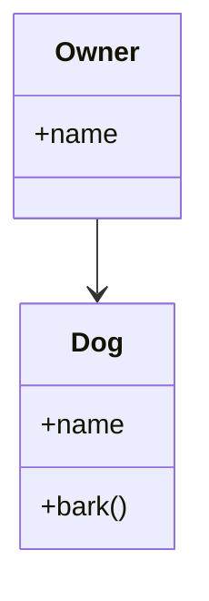
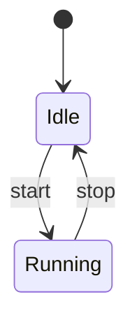
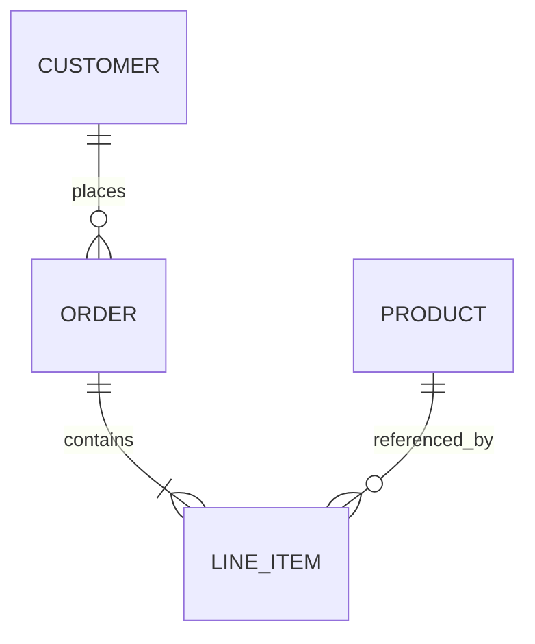
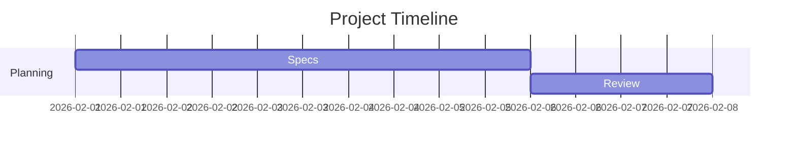
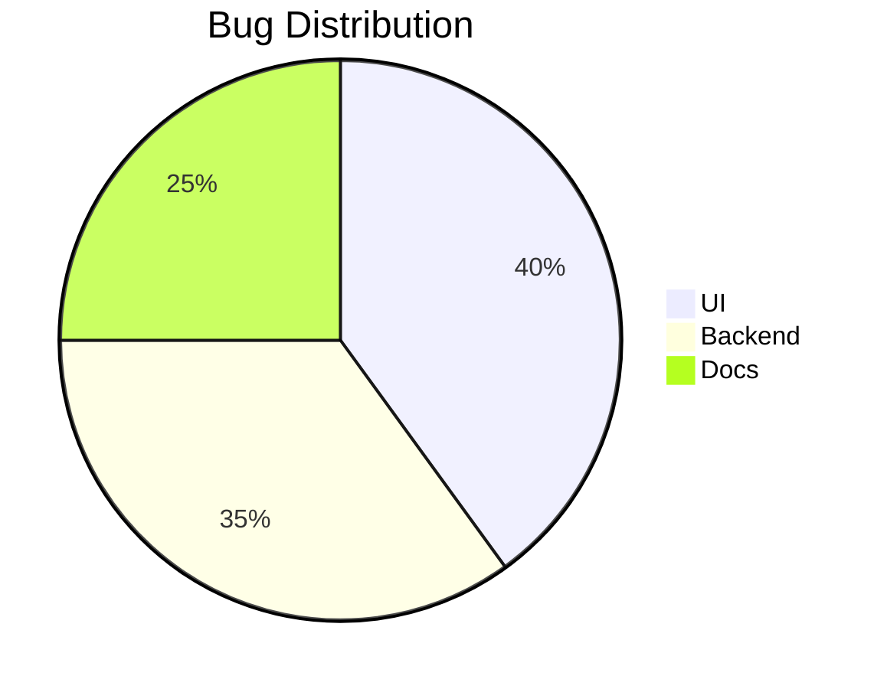
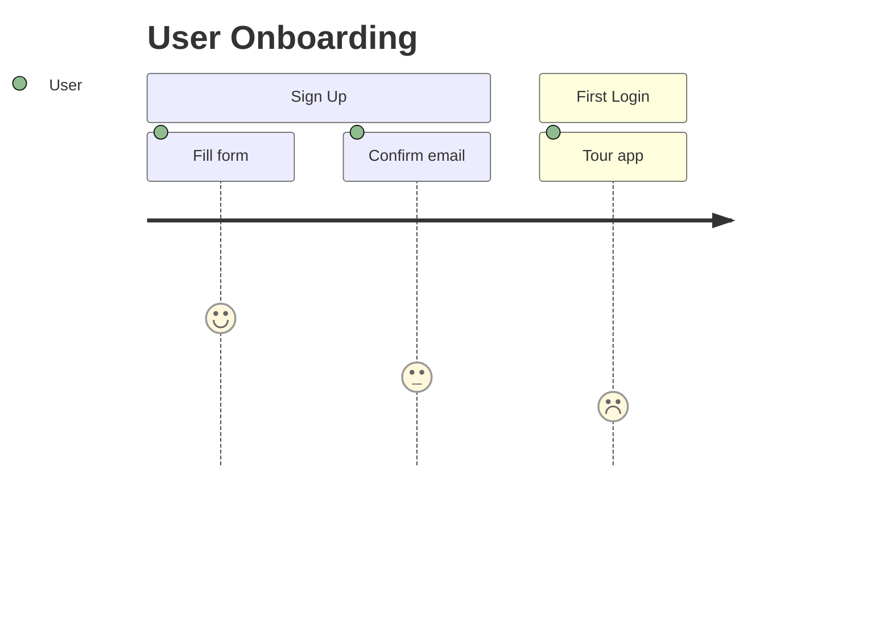
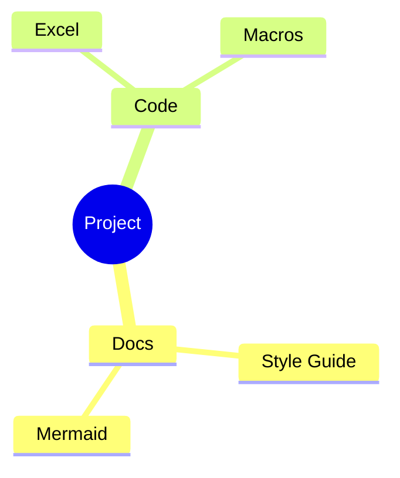
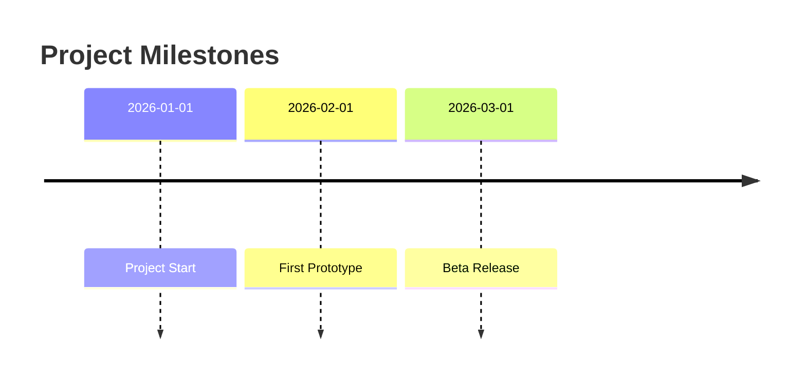

# Diagram Guideline

## Flowchart

## Sequence Diagram

## Class Diagram

## State Diagram

## Entity-Relationship Diagram

## Gantt Chart

## Pie Chart

## User Journey

## Mindmap

## Timeline

